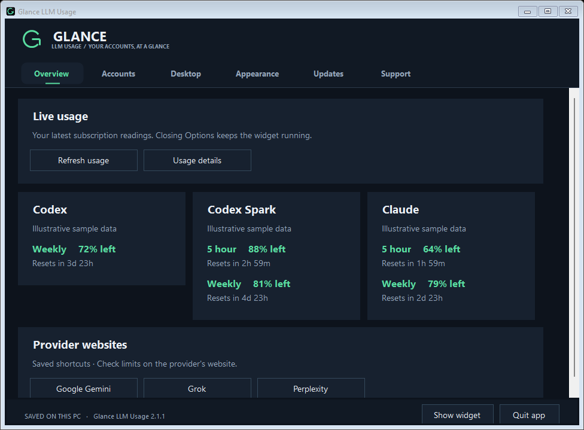
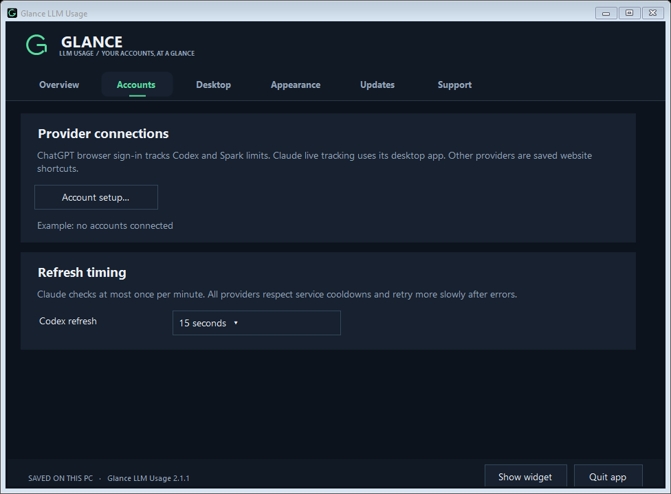
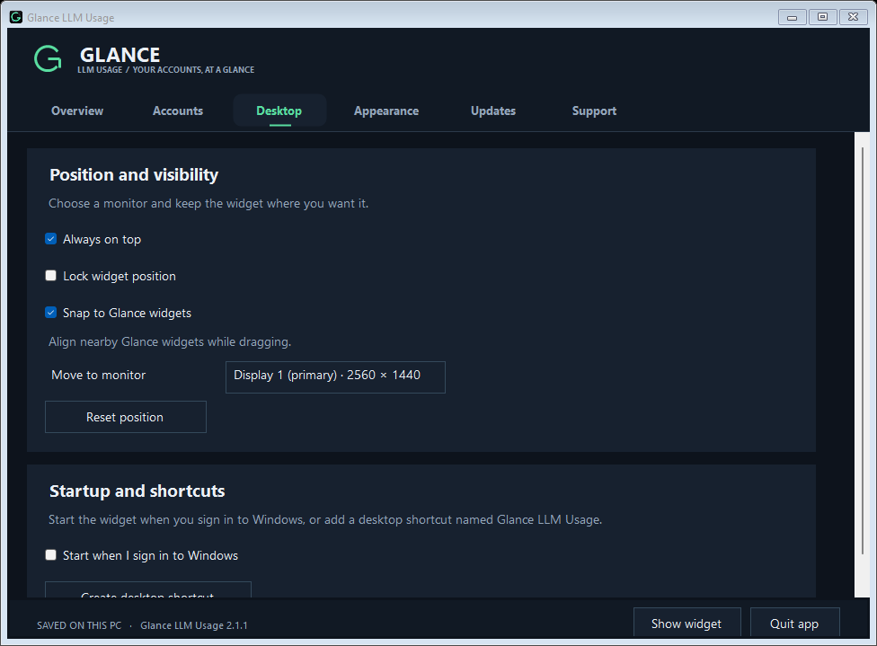
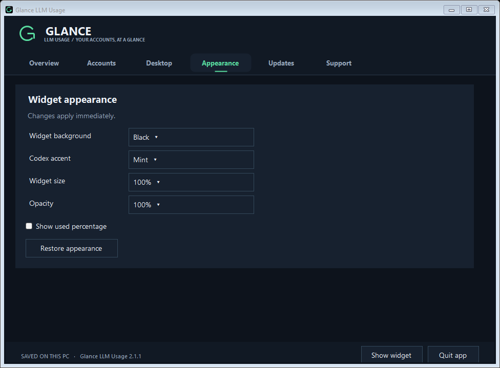
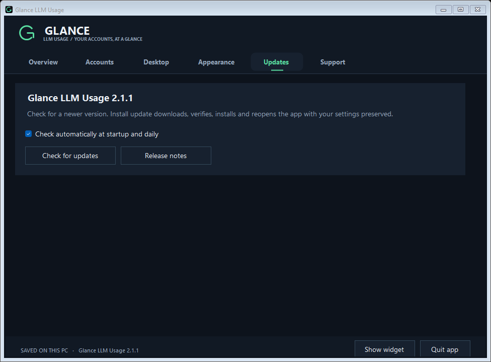
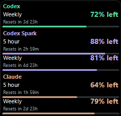
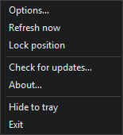
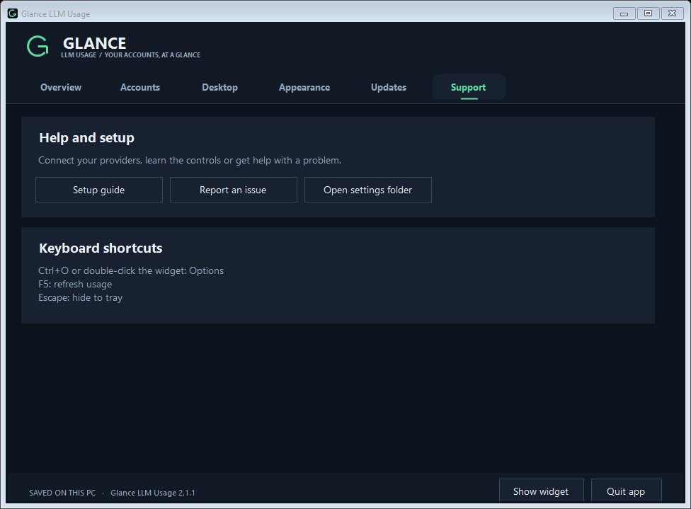
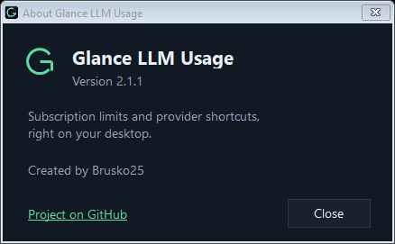

# Glance LLM Usage

A compact Windows app for **subscription limits and your favorite AI providers**. Browser sign-in supports live Codex/Spark limits; saved website shortcuts keep other major providers within reach. True-black background, a subtle outline matching Glance Finance, and the essential percentages and reset countdowns.

**[Download the Windows installer](https://github.com/Brusko25/Glance-LLM-Usage-Releases/releases/latest)** · **[Setup guide](USER_GUIDE.md)** · **[Changelog](CHANGELOG.md)** · **[Report an issue](https://github.com/Brusko25/Glance-LLM-Usage-Releases/issues)**

## Screenshots

Glance LLM Usage 2.1.1, captured from the actual release build with illustrative values and offline previews. Click any image for full size.

Options overview:

Provider accounts and supported connection types:

Shared snapping and desktop placement:

Widget appearance controls:

In-app updates:

Compact desktop widget with sample usage:

Quick menu:

Help and setup:

About and version information:

## Get started

1. Download and run the **Setup.exe**, or extract the **Windows.zip** portable package.
2. Open Glance LLM Usage and choose **Accounts → Account setup**. Save websites or finish setup now and connect later.
3. Use **Sign in with ChatGPT** for Codex/Spark limits without installing Codex desktop. A verified official OpenAI helper downloads on first sign-in. Other providers open in your browser; their automatic subscription tracking is unavailable in this version.
4. Drag the widget where you want it. Double-click it or choose right-click → Options for all controls.

Windows 10/11 x64-compatible with .NET Framework 4.8. No API key or development tools required. The installer runs per user, with optional desktop/startup shortcuts. The app and installer are unsigned. SHA-256 checksums accompany every release.

## New in 2.1.1

Codex usage checks now reuse one helper process across refreshes. On shutdown, Glance closes its input and lets it exit normally; forced termination is reserved for a helper that does not exit within the grace period. Both browser sign-in and existing Codex installations use this behavior. Existing settings and refresh intervals are preserved.

This update removes repeated forced helper termination. It does not establish that the reported Windows LSASS crash is resolved.

## Clean Options navigation

The widget and tray share Options, Refresh, Lock/Unlock position, Check for updates, About, Show/Hide, and Exit. Locking stays synchronized with Desktop settings. About shows the app version and project link. Full controls stay in Options: used percentage and opacity in Appearance; account setup and refresh timing in Accounts; usage details in Overview; guide in Support; update preferences in Updates. Existing provider choices and preferences are preserved.

## Provider connections

A subscription-first provider hub adds browser sign-in for ChatGPT/Codex and saved websites for ChatGPT, Claude, Gemini, Grok, Perplexity, DeepSeek, Mistral Le Chat, and Microsoft Copilot. Live connections and website shortcuts have distinct labels. No API key or developer billing setup is required; API usage/spending is not tracked.

The official OpenAI helper is downloaded only when you sign in, verified against pinned hashes, and given a separate account profile with Windows Credential Manager storage. Existing Codex and optional Claude desktop connections remain available. Fresh installations start with local account access off and can finish setup without connecting anything.

Choose **Install update** to download, verify, install and restart with your settings preserved. The full Options window includes desktop placement, appearance, startup, accounts, and support. Existing installations retain their settings and monitoring choices.

## What it shows

- Codex and Spark limits that your ChatGPT account exposes, via browser sign-in or an existing Codex installation. These are not every ChatGPT chat model's limits.
- Optional Claude five-hour and overall weekly limits through an existing desktop sign-in.
- Saved provider websites on Overview; website shortcuts do not generate live quota readings.
- Remaining or used percentages, progress bars, and reset countdowns.
- Codex checks every 15 seconds; Claude at most once per minute. Errors back off automatically and stale readings are marked.

No account credentials are bundled. Claude monitoring is off until explicitly enabled during setup. Its existing desktop credential is used locally and sent only to Anthropic's usage service; the widget does not copy Claude credentials or save usage history. ChatGPT browser credentials are handled separately by the official helper and Windows Credential Manager. Claude's internal interfaces can change; see the [guide](USER_GUIDE.md) for compatibility and troubleshooting.

This is the public download and documentation repository. Application source and development history are maintained privately. Releases contain an installer, portable ZIP, and checksums; automatic “Source code” downloads contain this documentation only.
