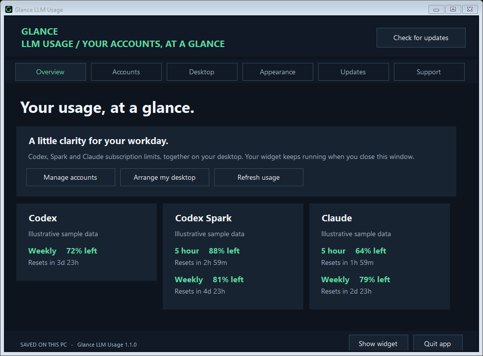
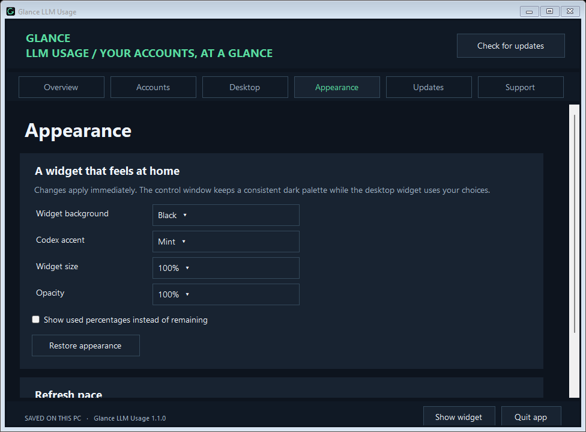
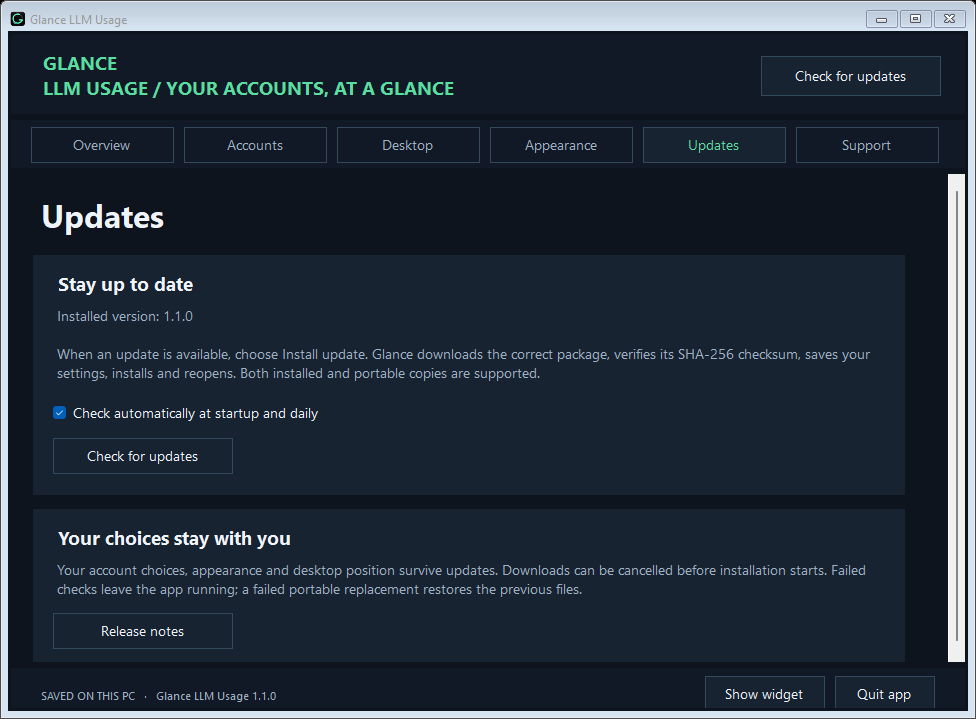

# Glance LLM Usage

A tiny Windows desktop widget for **Codex, Codex Spark, and Claude usage**. True-black background, no outer border, and just the essential percentages and reset countdowns.

**[Download the Windows installer](https://github.com/Brusko25/Glance-LLM-Usage-Releases/releases/latest)** · **[Setup guide](USER_GUIDE.md)** · **[Changelog](CHANGELOG.md)** · **[Report an issue](https://github.com/Brusko25/Glance-LLM-Usage-Releases/issues)**

## Screenshots

Glance LLM Usage 1.1.0, captured from the actual release build with illustrative values and offline previews. Click any image for full size.

Options overview:

Widget appearance controls:

In-app updates:

Compact desktop widget with sample usage:

Offline account setup:

Application icon:

## Get started

1. Download and run the **Setup.exe**, or extract the **Windows.zip** portable package.
2. Open Glance LLM Usage and select which accounts to monitor.
3. Sign in to the corresponding Codex and/or Claude desktop app on your PC. Enable Claude's local sign-in access only if you want Claude monitoring.
4. Drag the widget where you want it. Double-click it or choose right-click → Options for all controls.

Windows 10/11 x64-compatible with .NET Framework 4.8. No API key or development tools required. The installer runs per user, with optional desktop/startup shortcuts. The app and installer are unsigned. SHA-256 checksums accompany every release.

## New in 1.1.0

A full Options window brings together accounts, desktop placement, appearance, usage details, and updates. Customize widget size, background, accent, opacity and refresh pace. Manage startup and desktop shortcuts without rerunning setup.

Choose **Install update** to download, verify, install and restart with your settings preserved. Updates support installed and portable copies. Opening the desktop shortcut opens Options; close Options to keep monitoring active.

Existing installations keep their folder and provider choices. The software and shortcuts are named **Glance LLM Usage**. The installer rejects Glance Finance folders. Windows 10/11 x64-compatible with .NET Framework 4.8 is required; this is not a macOS or Linux application.

## What it shows

- Codex and Spark limits that your account exposes.
- Claude five-hour and overall weekly limits.
- Remaining or used percentages, progress bars, and reset countdowns.
- Codex checks every 15 seconds; Claude at most once per minute. Errors back off automatically and stale readings are marked.

No account credentials are bundled. Claude monitoring is off until explicitly enabled during setup. Its existing desktop credential is used locally and sent only to Anthropic's usage service; the widget does not save credentials or usage history. Claude's internal interfaces can change; see the [guide](USER_GUIDE.md) for compatibility and troubleshooting.

This is the public download and documentation repository. Application source and development history are maintained privately. Releases contain an installer, portable ZIP, and checksums; automatic “Source code” downloads contain this documentation only.
