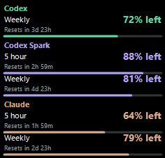
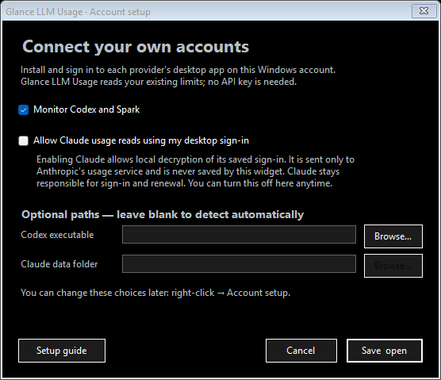

# Glance LLM Usage

A tiny Windows desktop widget for **Codex, Codex Spark, and Claude usage**. True-black background, no outer border, and just the essential percentages and reset countdowns.

**[Download the Windows installer](https://github.com/Brusko25/Glance-LLM-Usage-Releases/releases/latest)** · **[Setup guide](USER_GUIDE.md)** · **[Changelog](CHANGELOG.md)** · **[Report an issue](https://github.com/Brusko25/Glance-LLM-Usage-Releases/issues)**

## Screenshots

Glance LLM Usage 1.0.3, captured from the release build with illustrative values and offline account setup. Each installation connects to its owner's accounts. Click an image to see it full size.

Account setup (offline preview):

Application icon, extracted from the release executable:

## Get started

1. Download and run the **Setup.exe**, or extract the **Windows.zip** portable package.
2. Open Glance LLM Usage and select which accounts to monitor.
3. Sign in to the corresponding Codex and/or Claude desktop app on your PC. Enable Claude's local sign-in access only if you want Claude monitoring.
4. Drag the widget where you want it. Right-click for all options.

Windows 10/11 x64-compatible with .NET Framework 4.8. No API key or development tools required. The installer runs per user, with optional desktop/startup shortcuts. The app and installer are unsigned. SHA-256 checksums accompany every release.

## New in 1.0.3

The app checks its public GitHub releases shortly after startup and daily. Choose **Check for updates** from the widget or tray menu to check immediately. When a newer stable version is available, you can open the release page. Downloads and installation remain manual; update checks send no account credentials or workspace data.

### Installation compatibility

Glance Usage is now **Glance LLM Usage**, the Codex, Spark, and Claude subscription-usage widget. Existing installations retain their settings, provider choices, and installation folder. The executable remains GlanceUsage.exe.

New installations and shortcuts use **Glance LLM Usage Widget** to stay separate from the finance app that mistakenly used the LLM Usage name in version 2.4.0. The installer rejects finance installation folders. Update installation remains manual.

Looking for stock, crypto, and portfolio widgets? Use [Glance Finance](https://github.com/Brusko25/Glance-Finance-Releases).

## What it shows

- Codex and Spark limits that your account exposes.
- Claude five-hour and overall weekly limits.
- Remaining or used percentages, progress bars, and reset countdowns.
- Codex checks every 15 seconds; Claude at most once per minute. Errors back off automatically and stale readings are marked.

No account credentials are bundled. Claude monitoring is off until explicitly enabled during setup. Its existing desktop credential is used locally and sent only to Anthropic's usage service; the widget does not save credentials or usage history. Claude's internal interfaces can change; see the [guide](USER_GUIDE.md) for compatibility and troubleshooting.

This is the public download and documentation repository. Application source and development history are maintained privately. Releases contain an installer, portable ZIP, and checksums; automatic “Source code” downloads contain this documentation only.
